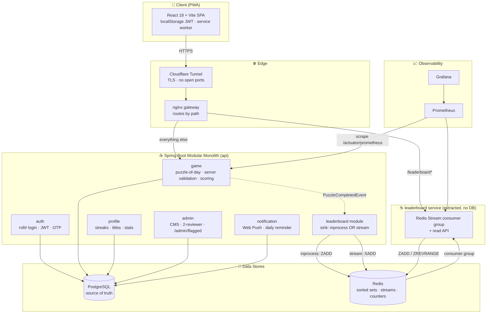
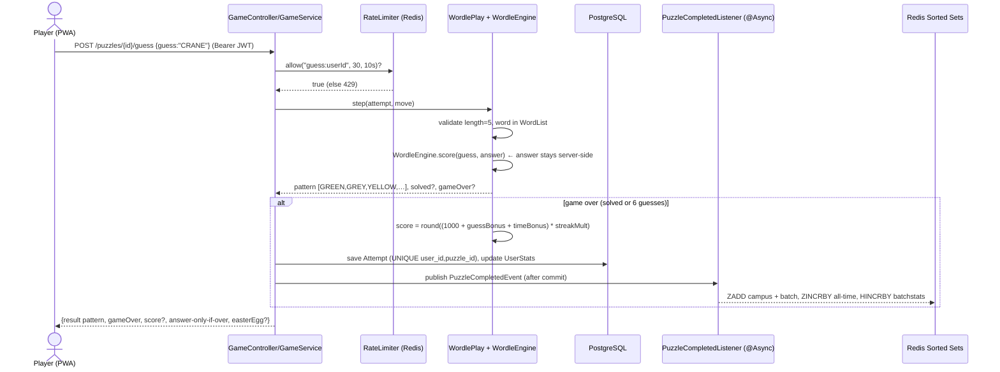
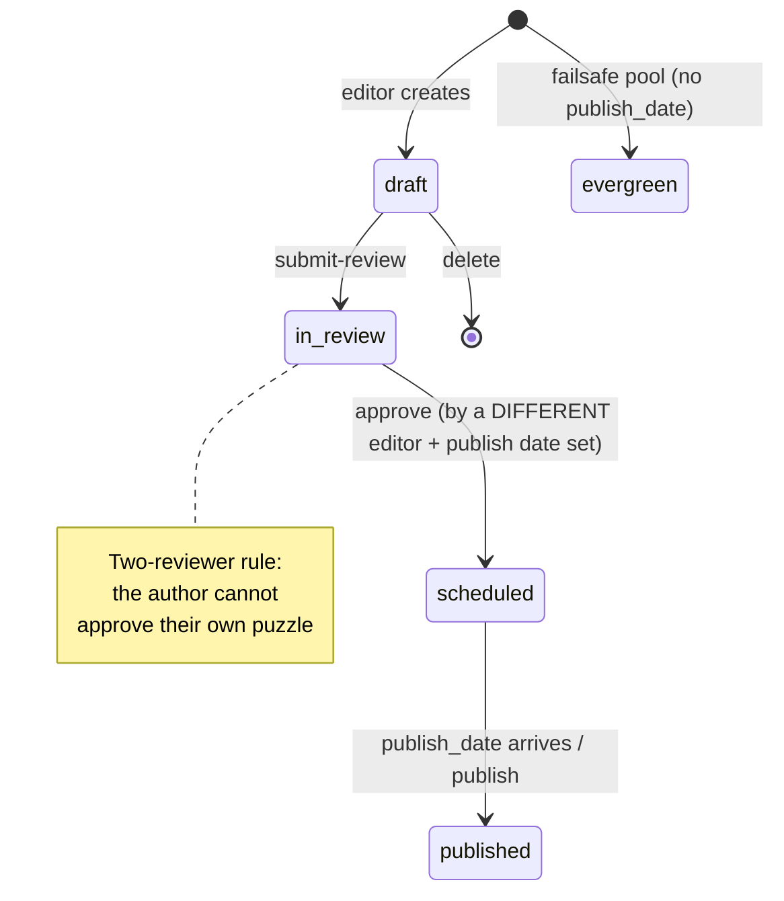

<div align="center">

# 🎮 8Bit Daily Puzzle
### A hyper-local, server-authoritative daily puzzle PWA for IIITB


</div>

---

## Table of Contents

1. [Project Overview](#1-project-overview)
2. [Domain Model](#2-domain-model)
3. [Architecture](#3-architecture)
   - [3.1 System Architecture](#31-system-architecture)
   - [3.2 The Event-Driven Leaderboard Seam](#32-the-event-driven-leaderboard-seam)
   - [3.3 Trace of One Guess (Sequence)](#33-trace-of-one-guess-sequence)
   - [3.4 Puzzle Editorial Lifecycle (State Machine)](#34-puzzle-editorial-lifecycle-state-machine)
4. [Repository Structure](#4-repository-structure)
5. [Libraries, Frameworks & Tools](#5-libraries-frameworks--tools)
6. [Methodology / How a Day Works End-to-End](#6-methodology--how-a-day-works-end-to-end)
7. [Setup & Installation](#7-setup--installation)
8. [Environment Variables Reference](#8-environment-variables-reference)
9. [Running the Project](#9-running-the-project)
10. [Features](#10-features)
11. [Performance & Design Characteristics](#11-performance--design-characteristics)
12. [Roadmap / Future Work](#12-roadmap--future-work)
13. [Appendix: Glossary](#13-appendix-glossary)

---

## 1. Project Overview

**8Bit Daily Puzzle** is a mobile-first **Progressive Web App (PWA)** that delivers a **daily puzzle** (Wordle and Connections) to students of IIITB. The hook is **hyper-local content** — campus lore and inside jokes a generic Wordle clone can't have — feeding a **campus-wide leaderboard** and a **batch-vs-batch "war"** on the homepage. An editorial team (the *8Bit Magazine* club) loads puzzles and hides easter eggs through an **admin CMS** with a two-reviewer workflow.

The engineering problem behind the game:

- **Anti-cheat must be real.** The answer is never sent to the browser. Every guess is validated **server-side** (`POST /puzzles/{id}/guess` returns only the colour pattern / group result), scores are computed **on the server** from validated moves, a `UNIQUE(user_id, puzzle_id)` constraint blocks replays, and impossibly fast solves are auto-flagged for editor review.
- **A midnight traffic spike** (everyone plays when the puzzle drops) must not collapse the system. The leaderboard write happens **asynchronously off a domain event** so the player's request returns instantly, and ranking is done with **Redis sorted sets** (sub-millisecond) rather than a Postgres `ORDER BY`.
- **It must run lean.** The stack is designed to run on a single small VM behind a Cloudflare Tunnel (no open inbound ports), with free-tier Postgres/Redis and tuned JVM heaps so two services fit comfortably together.

The backend is a **Spring Boot modular monolith** with a deliberate **event-driven seam**: when a player finishes, the `game` module publishes a `PuzzleCompletedEvent` and the `leaderboard` module consumes it. That seam is **extracted** into a standalone leaderboard microservice (driven by a Redis Stream + consumer group) behind a single config flag — so the same codebase runs as one deployable *or* as event-driven microservices.

---

## 2. Domain Model

This is a transactional application, so there is no external dataset. The "data" is the relational + Redis domain model the system maintains. The **source of truth is PostgreSQL**; **Redis** holds derived, hot, expiring state (leaderboards, rate-limit counters, OTP codes).

### PostgreSQL entities (JPA, `ddl-auto: update`)

| Entity | Table (key columns) | Purpose |
|---|---|---|
| `User` | roll_number (unique), username (unique), email (unique), password_hash (BCrypt), batch_year, roles, email_verified | A registered student or editor. Batch year is parsed from the roll number. |
| `GameType` | code (`wordle`, `connections`, `pixel`, `cipher`), active | Catalogue of game variants. |
| `Puzzle` | **UNIQUE(game_type, publish_date)**, status, difficulty, content (JSONB), easter_eggs (JSONB) | One puzzle per game per day. `content` is game-specific JSON (Wordle `{"answer":"PIXEL"}`, Connections `{"groups":[…]}`). Evergreen puzzles have no publish_date. |
| `Attempt` | **UNIQUE(user_id, puzzle_id)**, guesses (JSON), solved, score, completion_ms, flagged, flag_reason, started_at, finished_at | A single player's play of a puzzle. The unique constraint is the replay block. |
| `UserStats` | user_id, current_streak, best_streak, total_played, total_solved, last_solved_date, titles | Per-user streaks/titles. Persisted in Postgres (not just Redis) so streaks survive cache eviction. |
| `PushSubscription` | endpoint (unique), p256dh, auth, user_id | A browser's Web Push subscription. |

### Redis keyspace (derived / ephemeral)

| Key pattern | Type | Meaning |
|---|---|---|
| `lb:{type}:{date}:campus` | Sorted Set | Daily campus leaderboard (everyone). 3-day TTL. |
| `lb:{type}:{date}:batch:{year}` | Sorted Set | Daily per-batch board (verified accounts only). 3-day TTL. |
| `lb:{type}:alltime:campus` / `…:batch:{year}` | Sorted Set | All-time cumulative boards (`ZINCRBY`). |
| `lb:{type}:{date}:batchstats` | Hash | `{year}:sum` and `{year}:count` for the batch-war average. 3-day TTL. |
| `lb:usermeta` | Hash | `userId → "username\|batchYear"` so the no-DB leaderboard service can render names. |
| `rl:{bucket}:{slot}` | String (counter) | Fixed-window rate-limit counter. |
| `otp:{userId}` / `otp:attempts:{userId}` | String | Email OTP code + attempt counter (TTL = OTP expiry). |
| `stream:puzzle-completed` | Stream | The event bus when `app.leaderboard.sink=stream`. |

> **Source-of-truth rule:** Postgres is authoritative for users, puzzles, attempts and streaks. Redis is a fast derived layer that can be rebuilt; the daily boards intentionally expire after 3 days.

---

## 3. Architecture

A **modular monolith**: one Spring Boot deployable internally divided into modules (`auth`, `game`, `leaderboard`, `profile`, `admin`, `notification`, `common`, `bootstrap`) that talk only through public services and **Spring application events** — never reaching into each other's internals.

### 3.1 System Architecture



*Figure 1 — System architecture. The React PWA reaches the backend through a Cloudflare Tunnel and an nginx gateway. The gateway routes `/leaderboard*` to the extracted leaderboard service and everything else to the game API. Postgres is the source of truth; Redis serves leaderboards, the event stream, rate-limit counters and OTP codes. Prometheus scrapes both JVMs and Grafana visualises them.*

### 3.2 The Event-Driven Leaderboard Seam

The single coupling between `game` and `leaderboard` is one event. `PuzzleCompletedListener` is annotated **`@Async` + `@TransactionalEventListener`** (default `AFTER_COMMIT`), so the player's HTTP response returns *before* any ranking maths runs, and ranking only happens once the attempt is safely committed. A `LeaderboardSink` interface chooses the delivery mechanism by the single property `app.leaderboard.sink`:

```mermaid
flowchart LR
    P[Player finishes puzzle] -->|HTTP 200 instantly| P2[Player]
    P --> EV{{PuzzleCompletedEvent<br/>@Async @TransactionalEventListener AFTER_COMMIT}}
    EV --> SINK{app.leaderboard.sink}
    SINK -->|inprocess default| IPS[InProcessLeaderboardSink<br/>ZADD straight to Redis]
    SINK -->|stream| SLS[StreamLeaderboardSink<br/>XADD stream:puzzle-completed]
    IPS --> RZ[(Redis Sorted Sets)]
    SLS --> ST[(Redis Stream)]
    ST -->|consumer group leaderboard / lb-1| CONS[leaderboard service<br/>StreamConsumer]
    CONS --> RZ
```

*Figure 2 — The leaderboard seam. In the default `inprocess` mode the event handler writes Redis sorted sets directly inside the monolith. Flip `app.leaderboard.sink=stream` and the same event is `XADD`'d to a Redis Stream consumed by the standalone leaderboard service via a consumer group (`leaderboard`/`lb-1`). The consumer group makes the midnight burst durable: un-acked messages are redelivered after a restart, so nothing is lost.*

### 3.3 Trace of One Guess (Sequence)



*Figure 3 — Lifecycle of one guess. The rate limiter gates the call; the engine validates server-side and never returns the answer until the round is over; the score is computed from validated moves; and the leaderboard write is deferred to an async after-commit handler so the player never waits on ranking.*

### 3.4 Puzzle Editorial Lifecycle (State Machine)



*Figure 4 — Puzzle editorial state machine. A puzzle moves draft → in_review → scheduled → published. Approval enforces a two-reviewer rule (the author cannot approve their own work) and requires a publish date. Separately, an evergreen failsafe pool guarantees a puzzle is always servable even if editors leave a calendar gap.*

---

## 4. Repository Structure

```text
8Bit/
├── README.md                          # This file
├── 8Bit-Puzzle-Build-Doc.md           # Full design rationale (phases 1–7)
├── LAUNCH-GUIDE.md                     # Operator launch checklist
│
├── apps/
│   └── web/                            # React 18 + Vite 5 PWA  → Vercel / CF Pages
│       ├── vite.config.js              # vite-plugin-pwa (generateSW): SWR for today's puzzle,
│       │                               #   NetworkFirst for leaderboard/me/users
│       ├── index.html
│       ├── .env.example                # VITE_API_BASE (and VITE_LEADERBOARD_BASE)
│       └── src/
│           ├── main.jsx                # React root + router mount
│           ├── App.jsx                 # Route table (login/register/home/play/leaderboard/profile/u/admin)
│           ├── api.js                  # fetch wrapper: Bearer header, 401→logout, ~20 endpoint helpers
│           ├── auth.jsx                # auth context: login/register/logout, token+user in localStorage
│           ├── theme.js / styles.css   # dark retro theme (accent #9ED2E6; Press Start 2P + VT323)
│           ├── pages/                  # LoginPage, RegisterPage, HomePage, PlayPage, WordleGame,
│           │                           #   ConnectionsGame, LeaderboardPage, ProfilePage, UserPage, AdminPage
│           └── components/             # WordleGrid, Keyboard, ConnectionsBoard, ResultModal,
│                                       #   ConnectionsResultModal, EasterEggModal, BatchWarBar,
│                                       #   PushToggle, ThemeToggle, NavBar, ProtectedRoute, Toast,
│                                       #   InstallHint, VerifyEmailBanner
│
├── services/
│   ├── api/                            # Spring Boot 3.4 / Java 21 modular monolith
│   │   ├── pom.xml                     # web, data-jpa, data-redis, security, validation, mail,
│   │   │                               #   actuator, micrometer-prometheus, postgresql, jjwt, web-push
│   │   ├── Dockerfile                  # multi-stage; JAVA_OPTS -Xmx512m -XX:+UseSerialGC
│   │   └── src/main/
│   │       ├── resources/application.yml   # datasource/redis/jwt/cors/vapid/otp/seed/actuator config
│   │       └── java/com/eightbit/
│   │           ├── EightBitApplication.java   # @EnableAsync, @EnableScheduling
│   │           ├── auth/               # AuthController/Service, User, RollNumberParser, otp/*
│   │           ├── game/               # GameController/Service, Puzzle, Attempt, EasterEggService
│   │           │   ├── wordle/         # WordleEngine (two-pass scoring), WordList
│   │           │   ├── play/           # GamePlay strategy: WordlePlay, ConnectionsPlay
│   │           │   ├── dto/            # GameDtos
│   │           │   └── event/          # PuzzleCompletedEvent
│   │           ├── leaderboard/        # LeaderboardController/Service, PuzzleCompletedListener,
│   │           │   └── sink/           #   LeaderboardSink, InProcessLeaderboardSink, StreamLeaderboardSink
│   │           ├── profile/            # ProfileController, StatsService, UserStats
│   │           ├── admin/              # AdminController, AdminAuditController, AdminPuzzleService
│   │           ├── notification/       # PushController/Service, PushSubscription, DailyReminderJob
│   │           ├── common/             # config/* (AppProperties), security/* (JwtService, JwtAuthFilter,
│   │           │                       #   SecurityConfig), ratelimit/RateLimiter, web/* (exception handling)
│   │           └── bootstrap/          # DataSeeder (editor account + 14 days of puzzles + evergreen pool)
│   │
│   └── leaderboard/                    # Extracted leaderboard microservice (Phase 6) — NO DATABASE
│       ├── pom.xml / Dockerfile        # JAVA_OPTS -Xmx384m -XX:+UseSerialGC
│       └── src/main/java/com/eightbit/lb/
│           ├── LeaderboardServiceApplication.java
│           ├── StreamConsumer.java     # Redis Stream consumer group (lastConsumed offset, ACK)
│           ├── Leaderboards.java       # Redis sorted-set read/write + usermeta hash
│           ├── LeaderboardController.java # GET /leaderboard, /leaderboard/batch-war
│           ├── JwtReader.java          # validates the SAME JWT_SECRET as api (anon fallback)
│           └── CorsConfig.java
│
└── infra/
    ├── docker-compose.yml              # dev: postgres(5433) + redis(6379) + api(8080)
    ├── docker-compose.microservices.yml# gateway + api(sink=stream) + leaderboard + prometheus + grafana
    ├── gateway/nginx.conf              # /leaderboard* → leaderboard; /actuator → 404; rest → api
    ├── monitoring/                     # prometheus.yml + Grafana provisioning + 8bit.json dashboard
    ├── cloudflared/config.example.yml  # Cloudflare Tunnel ingress sample
    ├── github-actions/deploy.yml       # build → ghcr.io → SSH pull+restart api on push to main
    ├── loadtest/midnight-spike.js      # k6: ramp to 1000 VUs; thresholds <1% err, p95<800ms
    └── .env.example                    # JWT_SECRET, DB_PASSWORD, VAPID, MAIL, SEED_* templates
```

---

## 5. Libraries, Frameworks & Tools

| Layer | Technology | Version | Role in this project |
|---|---|---|---|
| Backend framework | **Spring Boot** (web, data-jpa, data-redis, security, validation, mail, actuator) | 3.4.2 | The modular monolith: REST, persistence, security, events, scheduling. |
| Language (backend) | **Java** (OpenJDK) | 21 | Backend runtime; modern records/switch used throughout. |
| ORM | **Spring Data JPA / Hibernate** | (Boot-managed) | Maps entities to PostgreSQL; `ddl-auto: update` auto-creates the schema. |
| Auth tokens | **JJWT** (`jjwt-api/impl/jackson`) | 0.12.6 | HS256 JWT mint + verify; shared secret across both services. |
| Password hashing | **Spring Security BCrypt** | (Boot-managed) | `BCryptPasswordEncoder` for password storage. |
| Cache / leaderboards / stream | **Redis** (via Spring Data Redis / Lettuce) | 7 | Sorted-set leaderboards, the event stream, rate-limit counters, OTP store. |
| Database | **PostgreSQL** | 16 | Source of truth (users, puzzles, attempts, stats, subscriptions). |
| Web Push | **nl.martijndwars:web-push** + **BouncyCastle** | 5.1.1 / 1.78.1 | VAPID-signed push messages to subscribed browsers. |
| Metrics | **Micrometer + Prometheus registry** | (Boot-managed) | Exposes `/actuator/prometheus`. |
| Frontend framework | **React** | 18.3 | The SPA UI. |
| Build / dev server | **Vite** | 5.4 | Frontend bundler + dev server. |
| Routing | **React Router** | 6.26 | Client-side routing + protected routes. |
| PWA | **vite-plugin-pwa** (Workbox `generateSW`) | 0.20.5 | Manifest, auto-update SW, offline caching of today's puzzle. |
| Gateway | **nginx** | 1.27 (image) | Path-based routing between api and leaderboard. |
| Containerisation | **Docker / Docker Compose** | — | Dev stack and microservices stack. |
| Edge / TLS | **Cloudflare Tunnel** (`cloudflared`) | — | No open inbound ports; hides origin IP. |
| Monitoring | **Prometheus + Grafana** | (images) | Scrape + dashboard ("8Bit Overview": req/s, p95, JVM heap, CPU). |
| Load testing | **k6** | — | `midnight-spike.js` ramps to 1000 concurrent VUs. |
| CI/CD | **GitHub Actions → ghcr.io → SSH** | — | Build image, push to registry, SSH-deploy `api`. |
| Mail (optional) | **Spring Boot Mail** (SMTP) | — | Sends OTP emails when configured; logs the code otherwise. |

---

## 6. Methodology / How a Day Works End-to-End

1. **Editorial (before the day).** Editors create puzzles in the admin CMS. A puzzle goes `draft → in_review → scheduled`. Approval requires a *second* editor and a publish date. A calendar view warns when the servable buffer drops below 14 days, and an **evergreen failsafe pool** guarantees something is always playable.
2. **Registration / login.** A student registers with a roll number (e.g. `IMT2023045`). `RollNumberParser` validates it against the configured regex `^(IMT|MT|MS|PH|DT)(\d{4})(\d{3,4})$` and extracts the **batch year** (group 2) and program. Passwords are BCrypt-hashed. On success the server mints a **12-hour HS256 JWT** carrying `userId`, `username`, `batchYear`, `roles`.
3. **Fetch the puzzle.** `GET /puzzles/today?type=wordle` returns the day's puzzle for the IST (`Asia/Kolkata`) date **without the answer**. Selection is: the puzzle with `(type, publish_date=today)` and a servable status; otherwise a deterministic pick from the evergreen pool (`pool.get(floorMod(epochDay, size))`).
4. **Play (server-authoritative).** Each guess hits `POST /puzzles/{id}/guess`. A **Redis fixed-window rate limiter** (30 guesses / 10 s per user) gates it. `WordlePlay`/`ConnectionsPlay` (a **strategy pattern** behind `GamePlay`) validate the move and call the engine. `WordleEngine` runs the classic **two-pass green-then-yellow** algorithm (handling repeated letters correctly) and returns only the colour pattern.
5. **Score (server-side).** On game over the server computes the score from validated moves: Wordle `round((1000 + (6−guesses)·120 + cappedTimeBonus) · streakMult)`; Connections `round((1000 + (4−mistakes)·150) · streakMult)`. The streak multiplier caps at 1.5×; the time bonus is floored at 0 with no reward for sub-2-second "solves" (anti-bot).
6. **Anti-cheat.** A `UNIQUE(user_id, puzzle_id)` constraint blocks replays. Solves that are impossibly fast (`<1.5 s`, or `≥3` moves in `<4 s`) are **flagged** with a reason for editor review at `GET /admin/flagged`.
7. **Persist + publish.** The attempt and updated `UserStats` (streaks, titles like *First Blood*, *Library Ghost*, *Streak Keeper*) are committed, then a `PuzzleCompletedEvent` is published.
8. **Rank (async).** After commit, the async listener writes Redis: `ZADD` to the daily campus board (everyone) and the daily batch board (verified accounts only), `ZINCRBY` to the all-time boards, and `HINCRBY` to the batch-war stats hash. The **batch war** ranks batches by average score, requiring ≥3 participants to lead.
9. **Read.** Leaderboards (`GET /leaderboard`) and batch war (`GET /leaderboard/batch-war`) are served from Redis sorted sets (`ZREVRANGE 0 99`, `ZREVRANK` for the caller's own rank) — no Postgres `ORDER BY` on the hot path.
10. **Notify.** A daily reminder job (cron `0 0 8 * * *` IST) sends a Web Push nudge to subscribed devices (if VAPID keys are configured).

---

## 7. Setup & Installation

### Prerequisites

| Tool | Version | Notes |
|---|---|---|
| JDK | 21+ | Production runtime is Java 21. On JDK 24+ the `pom.xml` passes `-Dnet.bytebuddy.experimental=true`. |
| Node.js | 20+ | For the React/Vite frontend. |
| Docker Desktop | recent | Postgres + Redis (and the full microservices stack). |
| Maven | bundled wrapper / 3.9+ | Builds the Spring services. |
| k6 | optional | Run the load test. |
| cloudflared | optional | HTTPS tunnel for phone testing / push. |

> **Port note:** the dev examples use backend port **8088** and Compose Postgres **5433** to avoid clashing with common local services. If your 8080/5432 are free, drop the overrides.

### Step 1 — Data stores (Docker)

```bash
cd infra
docker compose up -d postgres redis
```

### Step 2 — Backend (Spring Boot)

```bash
# from services/api
SERVER_PORT=8088 mvn spring-boot:run        # macOS/Linux
# Windows cmd:    set SERVER_PORT=8088 && mvn spring-boot:run
# PowerShell:     $env:SERVER_PORT=8088; mvn spring-boot:run
```

On first boot the app auto-creates the schema (JPA `ddl-auto: update`) and **seeds** 14 days of Wordle puzzles, 7 days of Connections, an evergreen pool, and an **editor account** (roll `IMT2022999`, username `editor`). The editor **password is randomly generated and printed once** to the startup logs (look for the `SEEDED EDITOR ACCOUNT` banner). Pin it with `SEED_EDITOR_PASSWORD`, or disable seeding in prod with `SEED_ENABLED=false`.

### Step 3 — Frontend (React PWA)

```bash
cd apps/web
cp .env.example .env          # set VITE_API_BASE to the backend, e.g. http://localhost:8088
npm install
npm run dev                   # → http://localhost:5173
```

Register with an IIITB-style roll number (e.g. `IMT2023045`). Log in as the editor to reach `/admin`. Two games are seeded: **Wordle** (`/play`) and **Connections** (`/play?game=connections`).

---

## 8. Environment Variables Reference

All secrets are supplied via environment variables / `.env` files, which are **git-ignored**. Copy the provided `.env.example` templates and fill in your own values.

| Variable | Default | Description |
|---|---|---|
| `SERVER_PORT` | `8080` | Backend HTTP port. |
| `DB_URL` | `jdbc:postgresql://localhost:5433/eightbit` | PostgreSQL JDBC URL. |
| `DB_USER` / `DB_PASSWORD` | `eightbit` / *(blank → trust auth)* | DB credentials. Set a real password in prod. |
| `DB_POOL_SIZE` | `20` | Hikari max pool size. |
| `REDIS_HOST` / `REDIS_PORT` / `REDIS_PASSWORD` | `localhost` / `6379` / *(blank)* | Redis connection. |
| `JWT_SECRET` | *(blank)* | HS256 signing key. Blank → ephemeral key (dev only, logs a warning). Must be ≥32 bytes and **identical** across both services. |
| `CORS_ORIGINS` | `*` | Allowed CORS origins (safe to leave `*` since auth is a Bearer header, not cookies). |
| `app.leaderboard.sink` (`APP_LEADERBOARD_SINK`) | `inprocess` | `inprocess` (monolith) or `stream` (XADD to Redis Stream for the extracted service). |
| `SEED_ENABLED` | `true` | Set `false` in prod to skip demo seeding. |
| `SEED_EDITOR_PASSWORD` | *(blank → random)* | Pin the seeded editor password. |
| `OTP_ENABLED` | `false` | Enable email-OTP verification (requires SMTP + `@iiitb.ac.in` emails). |
| `OTP_TTL_MINUTES` / `OTP_LENGTH` | `10` / `6` | OTP code lifetime and length. |
| `MAIL_HOST` / `MAIL_PORT` / `MAIL_USERNAME` / `MAIL_PASSWORD` | *(blank)* | SMTP relay; if blank, OTP codes are **logged** instead of emailed. |
| `VAPID_PUBLIC_KEY` / `VAPID_PRIVATE_KEY` | *(blank → push disabled)* | Web Push VAPID keypair. |
| `VITE_API_BASE` | `http://localhost:8080` | Frontend → backend base URL. |
| `VITE_LEADERBOARD_BASE` | *(defaults to API base)* | Optional separate leaderboard base. |
| `GATEWAY_PORT` | `8080` | Host port for the nginx gateway (microservices stack). |

---

## 9. Running the Project

### Dev (monolith)
Run the three steps in [§7](#7-setup--installation): Docker stores → Spring backend → Vite frontend.

### Microservices stack (Phases 6 + 7)

Runs the full event-driven stack — nginx gateway, `api` (publishing to a Redis Stream), the extracted `leaderboard` service, plus Prometheus + Grafana. A shared `JWT_SECRET` is required so both services validate the same tokens.

```bash
cd infra
export JWT_SECRET=any-long-random-string-at-least-32-bytes-here
export GATEWAY_PORT=8090
docker compose -f docker-compose.microservices.yml -p 8bitms up -d --build
```

- App (through the gateway): `http://localhost:8090` → point the frontend `VITE_API_BASE` here.
- **Grafana:** `http://localhost:3001` ("8Bit Overview" pre-provisioned). **Prometheus:** `http://localhost:9090`.
- Tear down: `docker compose -f docker-compose.microservices.yml -p 8bitms down -v`.

### Load test

```bash
k6 run -e BASE=http://localhost:8088 infra/loadtest/midnight-spike.js
# ramps to 1000 VUs; thresholds: <1% errors, p95 < 800ms (guesses p95 < 500ms)
```

### Phone testing
- **Same Wi-Fi:** set `VITE_API_BASE` to your PC's LAN IP, open the firewall for 5173/8088, browse `http://<PC-IP>:5173`.
- **Real HTTPS (install/push):** `npx cloudflared tunnel --url http://localhost:5173` (and one for the backend → put that URL in `VITE_API_BASE`). iOS 16.4+ needs the PWA installed before push works.

---

## 10. Features

- **Two games, one engine seam.** Wordle and Connections behind a `GamePlay` strategy interface; the content schema and interface are designed to accommodate additional game types.
- **Server-authoritative anti-cheat.** Answer never leaves the server; scoring is server-side; replays blocked by a unique constraint; fast-solve auto-flagging with an editor audit endpoint.
- **Redis sorted-set leaderboards.** Campus + per-batch, daily + all-time, with a batch-vs-batch "war" (average score, ≥3-participant floor).
- **Event-driven, extractable leaderboard.** One config flag switches between in-process and a Redis-Stream-backed standalone microservice with a durable consumer group.
- **Roll-number auth.** Login by roll number, batch parsed from it; stateless JWT; role-gated `/admin/**`.
- **Editorial CMS.** Two-reviewer workflow, calendar with gap/buffer warnings, evergreen failsafe, easter eggs.
- **PWA.** Installable, offline-for-today (stale-while-revalidate), Web Push subscription plumbing, retro pixel theme with light/dark + colourblind-safe tile symbols.
- **Streaks & titles.** Persisted streaks and earned titles (*First Blood*, *Library Ghost*, *Streak Keeper*).
- **Lean ops story.** Single small VM behind a Cloudflare Tunnel + static hosting for the PWA; tuned JVM heaps (`-Xmx512m` + `-Xmx384m`) so both services fit comfortably.
- **Observability + load test.** Prometheus/Grafana dashboard and a k6 midnight-spike test to 1000 VUs.

---

## 11. Performance & Design Characteristics

The system is engineered so the read and write hot paths stay cheap under the midnight burst:

- **The hot path is cheap by construction.** Guess validation is an in-memory string compare (no DB read to decide right/wrong); the leaderboard write is async after commit; ranking is `ZADD` / `ZREVRANGE 0 99` / `ZREVRANK` (sub-millisecond); writes are bounded to ≤1 per user per puzzle by the unique constraint.
- **Asynchronous ranking.** Because `PuzzleCompletedListener` runs `@Async` `AFTER_COMMIT`, the player's HTTP response returns before any ranking maths runs, keeping perceived latency flat during the spike.
- **Durable event delivery.** In `stream` mode the Redis Stream consumer group redelivers un-acked messages after a restart, so no completed attempt is lost during the burst.
- **Defined load profile.** `infra/loadtest/midnight-spike.js` models the workload — ramp to 1000 VUs over 1 min, hold 2 min, drain 30 s — with thresholds `http_req_failed < 1%`, `http_req_duration p95 < 800 ms`, and guess `p95 < 500 ms`.
- **Observability.** The Grafana "8Bit Overview" dashboard tracks request rate by service, p95 latency, JVM heap, and process CPU — the four signals that matter for this workload.

---

## 12. Roadmap / Future Work

- **Refresh-token rotation** — short-lived access tokens + rotating refresh tokens for longer-lived sessions.
- **Web Push display** — add a service-worker `push` handler (via `vite-plugin-pwa` `injectManifest`) to render received notifications, complementing the existing subscribe/send plumbing.
- **College-email OTP end-to-end** — enable `OTP_ENABLED`, wire SMTP, and enforce verification before prize rounds. (`email_verified` already gates batch-leaderboard inclusion to prevent batch-stuffing.)
- **More games** — implement Pixel Reveal / Cipher behind the existing `GamePlay` strategy + content schema and build their UIs.
- **Admin viewer for `/admin/flagged`** — surface the anti-cheat audit in the CMS UI (the backend endpoint already exists).
- **Production hardening** — managed migrations (`ddl-auto: validate` + Flyway/Liquibase), registration rate limiting, and an automated test suite.
- **Scale-out** — when simultaneous writers reach the tens of thousands, run the leaderboard service permanently (`sink=stream`), shard Redis, and move Postgres to a managed tier.

---

## 13. Appendix: Glossary

| Term | Meaning in this project |
|---|---|
| **Modular monolith** | One deployable, internally split into modules that talk only via services + events. |
| **Server-authoritative** | The server, not the client, decides validity and score; the answer never reaches the browser mid-game. |
| **`@TransactionalEventListener` (AFTER_COMMIT)** | An event handler that fires only after the DB transaction commits, so the leaderboard never ranks an attempt that rolled back. |
| **`@Async`** | The handler runs on a separate thread pool, so the player's HTTP request returns immediately. |
| **Redis Sorted Set (ZSET)** | A score-ordered set; `ZADD` writes, `ZREVRANGE`/`ZREVRANK` read top-N / a member's rank in O(log N). |
| **Redis Stream + consumer group** | An append-only log (`XADD`) read by a named group; un-acked messages are redelivered, making the midnight burst durable. |
| **VAPID** | Voluntary Application Server Identification — the keypair that authorises Web Push messages. |
| **Batch war** | Batch-vs-batch ranking by average score (verified accounts only, ≥3-participant floor). |
| **Evergreen puzzle** | A no-date failsafe puzzle picked deterministically when editors leave a calendar gap. |
| **Strategy pattern (`GamePlay`)** | One interface (`WordlePlay`, `ConnectionsPlay`) so new games are content + a class, not a rewrite. |
| **Fixed-window rate limiter** | `INCR` a per-time-slot Redis key with TTL; reject once the count exceeds the limit. |

---

<div align="center">
  <sub>Built for the <b>8Bit Magazine Club, IIITB</b> · server-authoritative, event-driven · see <a href="./8Bit-Puzzle-Build-Doc.md">the design doc</a> for full rationale</sub>
</div>
